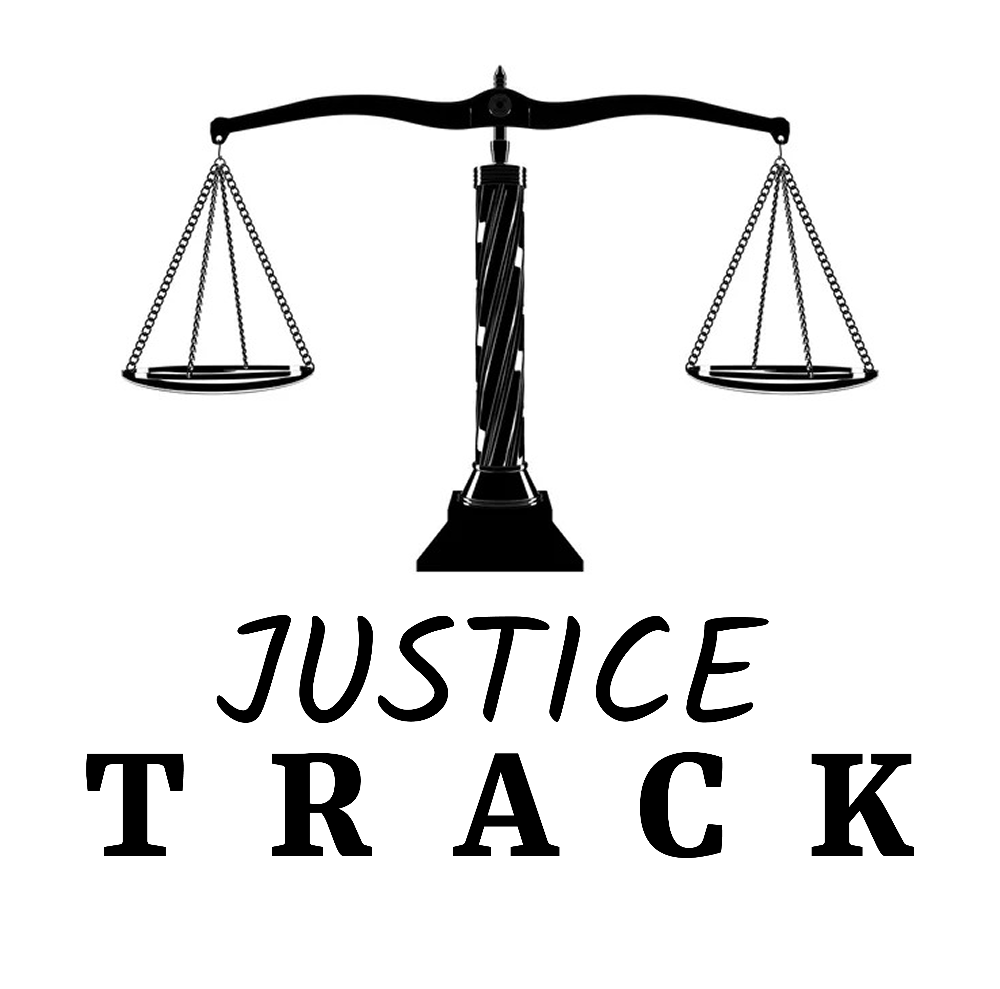

# JusticeTrack: Making Legal Navigation Accessible

<div align="center">
  
  <h3>Simplifying Access to Justice</h3>
</div>

## 📋 Project Overview

JusticeTrack is an innovative platform designed to make legal processes more accessible and understandable for everyone. Built for the Justice Technology Hackathon 2025, this project aims to bridge the gap between complex legal systems and the average citizen.

### 🌟 Key Features

- **Interactive Case Tracking**: Real-time status updates on legal proceedings
- **AI-Powered Document Summarization**: Simplifies legal documents into understandable language
- **Legal Advocate Directory**: Connect with qualified advocates based on expertise and location
- **Comprehensive Legal Glossary**: 30+ legal terms explained in plain language
- **User-Friendly Dashboard**: Track case history and manage legal documentation

## 🏗️ Architecture

This project is structured with a frontend-focused approach for the hackathon demonstration:

```
justice-track-project/
├── frontend/           # React-based user interface
│   ├── src/            # Source code
│   └── README.md       # Frontend-specific documentation
├── backend/            # Server-side application (placeholder for future development)
└── README.md           # Project overview (this file)
```

## 🚀 Quick Start

### Running the Frontend Application

```bash
# Navigate to frontend directory
cd frontend

# Install dependencies
npm install

# Start development server
npm run dev
```

The application will be available at `http://localhost:5173`

### Demo Credentials

For testing the application features:

- **Email**: jamie.smith@example.com
- **Password**: password123

## 💡 Inspiration

JusticeTrack was created to address several challenges in accessing justice:

- Complex legal language and processes that intimidate non-lawyers
- Difficulty in finding appropriate legal representation
- Lack of transparency in case progression
- Limited access to legal information for underserved communities

## 🛠️ Technology Stack

- **Frontend**: React.js, Vite, Tailwind CSS
- **UI/UX**: Responsive design, accessibility-focused components
- **State Management**: React Context API
- **Data Handling**: Mock services (with API-ready architecture)

## 🔮 Future Development

- Backend implementation with Node.js and Express
- User authentication with JWT
- Integration with court case management APIs
- Document upload and management features
- Mobile applications for iOS and Android

## 👥 Hackathon Team

- Developer / UX Designer
- frontend developer
- blockchain and ai developer
- UI Designer

## 📝 License

This project is licensed under the MIT License - see the LICENSE file for details.

---

<div align="center">
  <p><strong>JusticeTrack: Empowering Citizens Through Legal Transparency</strong></p>
  <p>Developed for the Justice Technology Hackathon 2025</p>
</div> 


Thank you for taking the time to explore JusticeTrack! We hope this platform inspires you to think about how technology can make legal systems more accessible and equitable for everyone. If you have any questions, feedback, or ideas for collaboration, feel free to reach out. Together, we can simplify access to justice and empower communities worldwide.

Happy coding and innovating! 🚀
